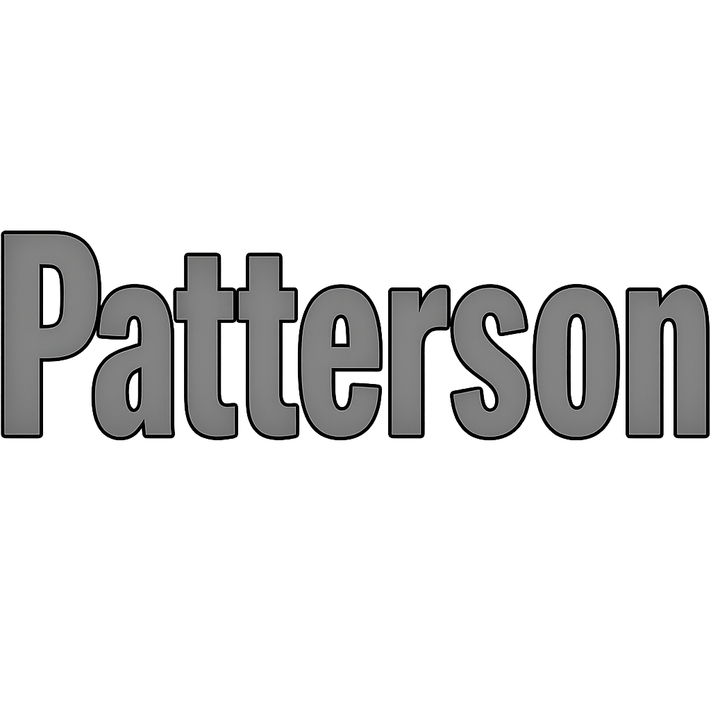
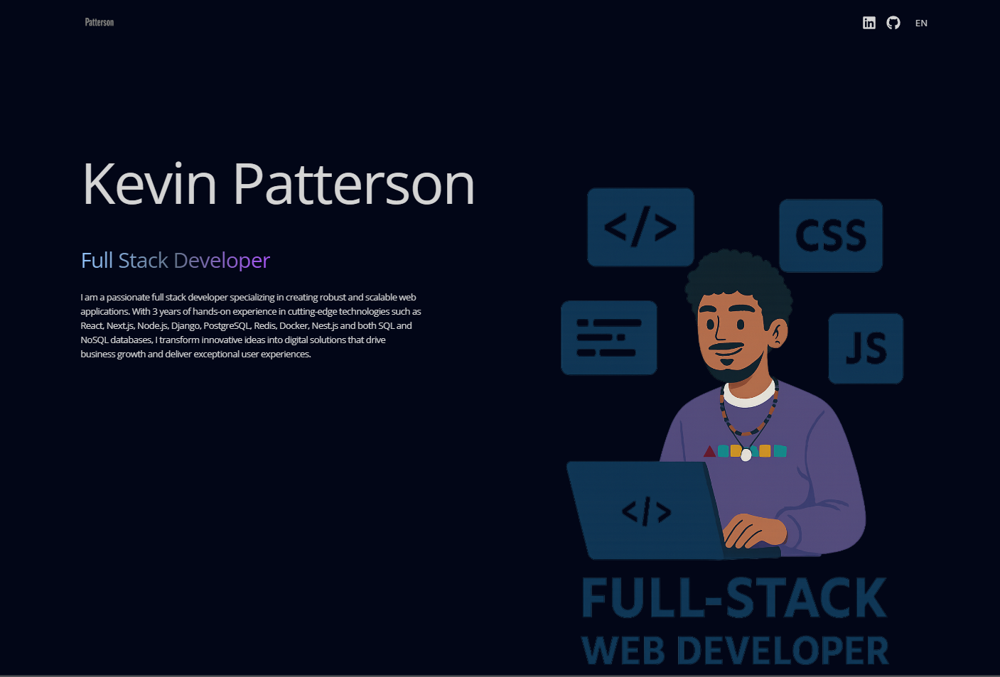

<!-- PROJECT LOGO -->
<br />
<div align="center">
  <a href="https://patterson-portfolio.vercel.app">
    
  </a>

  <h3 align="center">Patterson Portfolio Template</h3>

  <p align="center">
    Un template de portfolio moderno y profesional con React, TypeScript y animaciones fluidas
    <br />
    <br />
    <a href="https://patterson-portfolio.vercel.app"><strong>Ver Demo en Vivo »</strong></a>
    <br />
    <br />
    <a href="https://github.com/KevPatterson/Portfolio/issues">Reportar Bug</a>
    ·
    <a href="https://github.com/KevPatterson/Portfolio/issues">Solicitar Feature</a>
  </p>
</div>

<!-- ABOUT THE PROJECT -->
## 🚀 Sobre el Proyecto



Un template de portfolio minimalista y elegante diseñado para desarrolladores que quieren destacar su trabajo de forma profesional. Construido con las últimas tecnologías web y optimizado para rendimiento y seguridad.

### ✨ Características Principales

* 🎨 **Diseño Moderno**: Interfaz limpia con gradientes animados y efectos visuales sutiles
* 🌐 **Multiidioma**: Soporte completo para inglés y español con i18next
* 📱 **Totalmente Responsivo**: Adaptado para todos los dispositivos y tamaños de pantalla
* ⚡ **Alto Rendimiento**: Construido con Vite para tiempos de carga ultrarrápidos
* 🔒 **Seguridad Reforzada**: Headers de seguridad configurados (CSP, HSTS, X-Frame-Options, etc.)
* 🎭 **Animaciones Fluidas**: Transiciones suaves con Framer Motion
* 🎯 **SEO Optimizado**: Meta tags, sitemap y robots.txt incluidos
* 🖱️ **Efectos Interactivos**: Mouse trail y hover effects personalizados
* 📊 **Secciones Completas**: Hero, About, Technologies, Experience, Projects y Contact

### 🛠️ Tecnologías Utilizadas

#### Frontend
* [React 19](https://react.dev/) - Biblioteca de UI
* [TypeScript](https://www.typescriptlang.org/) - Tipado estático
* [Vite 7](https://vitejs.dev/) - Build tool y dev server
* [Tailwind CSS 3](https://tailwindcss.com/) - Framework de CSS utility-first
* [Framer Motion 12](https://www.framer.com/motion/) - Librería de animaciones

#### Internacionalización
* [i18next](https://www.i18next.com/) - Framework de internacionalización
* [react-i18next](https://react.i18next.com/) - Integración con React
* [i18next-browser-languagedetector](https://github.com/i18next/i18next-browser-languageDetector) - Detección automática de idioma

#### Herramientas de Desarrollo
* [ESLint](https://eslint.org/) - Linter de código
* [PostCSS](https://postcss.org/) - Procesador de CSS
* [Autoprefixer](https://github.com/postcss/autoprefixer) - Prefijos CSS automáticos

#### Deployment
* [Vercel](https://vercel.com/) - Hosting y deployment continuo

## 📋 Prerequisitos

Asegúrate de tener instalado Node.js (versión 18 o superior) y npm:

```sh
node --version  # v18.0.0 o superior
npm --version   # 9.0.0 o superior
```

## 🔧 Instalación

Sigue estos pasos para configurar el proyecto localmente:

1. **Clona el repositorio**
   ```sh
   git clone https://github.com/KevPatterson/Portfolio.git
   cd Portfolio
   ```

2. **Instala las dependencias**
   ```sh
   npm install
   ```

3. **Inicia el servidor de desarrollo**
   ```sh
   npm run dev
   ```

4. **Abre tu navegador**
   
   Visita `http://localhost:5173` para ver el proyecto en acción

## 📜 Scripts Disponibles

```sh
npm run dev      # Inicia el servidor de desarrollo
npm run build    # Genera el build de producción
npm run preview  # Previsualiza el build de producción
npm run lint     # Ejecuta el linter para verificar el código
```

## 🎨 Personalización

### Modificar Contenido Personal

1. **Información Personal**: Edita `src/locales/es/translation.json` y `src/locales/en/translation.json`
2. **Imágenes**: Reemplaza las imágenes en `src/assets/` con las tuyas
3. **Proyectos**: Actualiza los datos en los archivos de traducción
4. **Colores**: Modifica el tema en `tailwind.config.js`
5. **Metadata SEO**: Actualiza `index.html` y `public/sitemap.xml`

### Estructura de Carpetas

```
src/
├── assets/          # Imágenes y recursos estáticos
├── components/      # Componentes React
│   ├── footer/      # Componente de contacto
│   ├── main/        # Secciones principales
│   └── nav/         # Navegación
├── context/         # Context API (idioma)
├── locales/         # Archivos de traducción
├── types/           # Definiciones de TypeScript
└── utils/           # Funciones auxiliares
```

## 🔒 Seguridad

Este proyecto implementa múltiples capas de seguridad:

- Content Security Policy (CSP)
- HTTP Strict Transport Security (HSTS)
- X-Frame-Options (protección contra clickjacking)
- X-Content-Type-Options (prevención de MIME sniffing)
- Referrer Policy
- Permissions Policy

Para más detalles, consulta `docs/SECURITY.md` y `docs/SECURITY_HEADERS.md`

## 🌍 Deployment

El proyecto está configurado para deployment automático en Vercel:

1. Haz fork del repositorio
2. Conecta tu repositorio con Vercel
3. Vercel detectará automáticamente la configuración de Vite
4. ¡Tu portfolio estará en línea en minutos!

## 🤝 Contribuciones

Las contribuciones son lo que hace que la comunidad open source sea un lugar increíble para aprender, inspirar y crear. Cualquier contribución que hagas será **muy apreciada**.

Si tienes una sugerencia para mejorar esto:

1. Haz Fork del proyecto
2. Crea tu Feature Branch (`git checkout -b feature/AmazingFeature`)
3. Commit tus cambios (`git commit -m 'Add: nueva característica increíble'`)
4. Push a la Branch (`git push origin feature/AmazingFeature`)
5. Abre un Pull Request

También puedes simplemente abrir un issue con la etiqueta "enhancement".

¡No olvides darle una estrella al proyecto! ⭐

## 📝 License

Distribuido bajo la licencia especificada en `LICENSE.TXT`. Ver el archivo para más información.

## 📧 Contacto

**Kevin Patterson**

📧 Email: kevinpatterson618@gmail.com

🔗 Demo: [https://patterson-portfolio.vercel.app](https://patterson-portfolio.vercel.app)

🐙 GitHub: [https://github.com/KevPatterson/Portfolio](https://github.com/KevPatterson/Portfolio)

---

<div align="center">
  Hecho con ❤️ por Kevin Patterson
</div>

